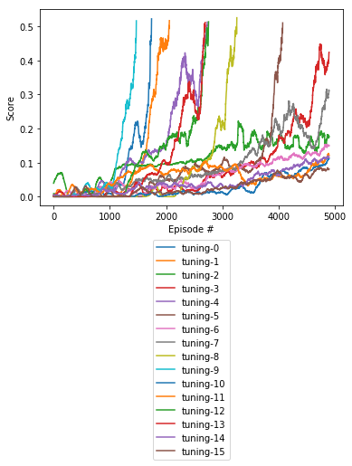

# Udacity DRLND Project 03 Report

## Introduction

This report is a part of [this repository](https://github.com/rwiatr/deep-reinforcement-learning) and was created for 
the [Collaboration and Competition](https://github.com/rwiatr/deep-reinforcement-learning/blob/master/collaboration_and_competition/README.md) project.

## Learning Algorithm

This task was solved using [Deep Deterministic Policy Gradient (DDPG)](https://arxiv.org/abs/1509.02971).
DDPG learns a Q-function and uses it to learn a policy &pi;. 
A detailed description can be found [here](https://spinningup.openai.com/en/latest/algorithms/ddpg.html).
DDPG can be thought of as being deep Q-learning for continuous action space.

DDPG is na Actor Critic method. 
The Actor maps state st directly to an action at.
The Critic estimates Qt the Q-Value function.
In the training phase the Critic calculates the Q-value for an action at chosen by the target Actor.
Then the local Actor updates its weights according to the direction suggested by the Critic (based on the Q-value calculated in the previous step).

Some modifications were made to the algorithm:
* Experience Replay Buffer (ERB). ERB is used to store agent experiences 
et = (st, at, rt, st+1)
where st is a state s in time t, at is a action taken in st,
rt is the reward and st+1 is the next state of the environment.
ERB separates the learning phase from the experience gaining phase. The learning phase is done
by sampling a random batch from the ERB. 
Random sampling introduces more independence into the training bach.
* OU Noise - OU Noise (based on [Ornstein-Uhlenbeck process](https://en.wikipedia.org/wiki/Ornstein%E2%80%93Uhlenbeck_process)).
In my case I use it to introduce noise into the decisions taken by the Agent NNs thus introducing some random exploration.
* local and target soft-update process. I use two Actor-Critic modules. One is used for training (local), the second one
is used for decision making (target). After each learning episode end the weights are being copied from the local
module to the target module with regards to parameter tau. Soft-update is used to stabilize the learning process. 

### Neural Network Architecture
Both, Critic and Actor design was based on the [original paper](https://arxiv.org/abs/1509.02971).
For the Actor I used a fully connected network with two layers: 24x256 and 256x2. 
For the Critic I used a fully connected network with five layers: 24x256, 256(+2 action)x256, 256x128 and 128x1.
## Result
It took 1571 episodes to achieve the score of 0.51. The agent was cut off after reaching this target.

During the experiment I found that it is challenging to predict if an agent will be able to start learning.
In some cases it took 2000 iterations to train an agent while in other cases it took over 5000.
### Hyperparameters
Hyperparameters were generated with using sampling of hyperparameters space and
then I selected hyperparameters that gave the best effect:

| Name | Value | Description |
|:-------------|:-------------|:-----|
| buffer_size | 1e5 | Size of the memory buffer for storing events |
| batch_size | 512 | Batch size for training the network  |
| gamma | 0.99 | discount factor |
| tau | 1e-3 | network interpolation parameter |
| lr_a | 1e-4 | Actor learning rate |
| lr_c | 1e-4 | Critic learning rate |

## Future work
 - [ ] Prioritize experience replay
 - [ ] Implement CNN as input
 - [ ] Make training more predictable
 - [ ] Implement MADDPG