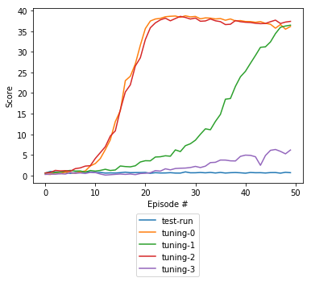
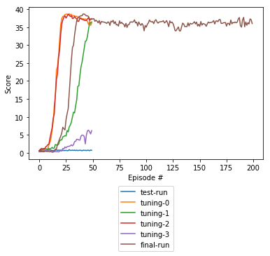

# Udacity DRLND Project 02 Report

## Introduction

This report is a part of [this repository](https://github.com/rwiatr/deep-reinforcement-learning) and was created for 
the [Continuous Control](https://github.com/rwiatr/deep-reinforcement-learning/blob/master/continuous_control/README.md) project.

## Learning Algorithm

This task was solved using [Deep Deterministic Policy Gradient (DDPG)](https://arxiv.org/abs/1509.02971).
DDPG learns a Q-function and uses it to learn a policy &pi;. 
A detailed description can be found [here](https://spinningup.openai.com/en/latest/algorithms/ddpg.html).
DDPG can be thought of as being deep Q-learning for continuous action space.

### Neural Network Architecture
Both, Critic and Actor networks were designed in the same way as in the [original paper](https://arxiv.org/abs/1509.02971)
with the exceptions of some hyperparameters. L2 was set to 0 for both networks
and Actor learning rate was set to 10-3.

## Result
It took about 15 episodes to achieve the score of 30. After this point the score went up to over 38.
The interesting thing happens after this point. The score goes down slightly as if the agent forgot
some of its past experience.

The second plot shows the stability of the agent over 200 episodes.

### Hyperparameters
Hyperparameters were generated with using sampling of hyperparameters space and
then I selected hyperparameters that gave the best effect:

| Name | Value | Description |
|:-------------|:-------------|:-----|
| buffer_size | 1e5 | Size of the memory buffer for storing events |
| batch_size | 512 | Batch size for training the network  |
| gamma | 0.99 | discount factor |
| tau | 1e-3 | network interpolation parameter |
| lr_a | 1e-3 | Actor learning rate |
| lr_c | 1e-4 | Critic learning rate |

## Future work
 - [ ] Prioritize experience replay
 - [ ] Implement CNN as input
 - [ ] Stabilize long learning
 - [ ] Investigate how the agent forgets its experience
