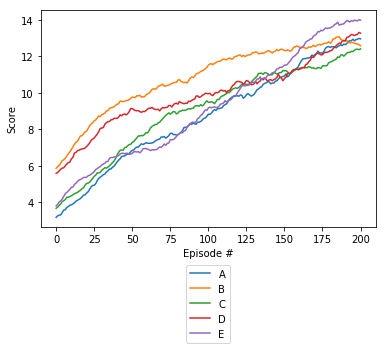

# Udacity DRLND Project 01 Report

## Introduction

This report is a part of [this repository](https://github.com/rwiatr/deep-reinforcement-learning) and was created for 
the [Navigation](https://github.com/rwiatr/deep-reinforcement-learning/blob/master/navigation/README.md) project.

## Method

## Result
It took only 250 epochs to train an agent that is able to solve the 
environment achieving a average reward of 13+ over last 100 epochs and 270 epochs to get to 14+. 

| Name | Value | Description |
|:-------------|:-------------|:-----|
| buffer_size | 1e5 | Size of the memory buffer for storing events |
| batch_size | 64 | Batch size for training the network  |
| gamma | 0.99 | |
| tau | 1e-3 | |
| lr | 5e-4 | Learning rate |
| update_every | 4 | How many steps should the agent take before the training will be executed |
| fc_size | 64 | Number of neurons in each hidden layer |

| Agent | target &epsilon; | &epsilon; step |
|:-------------|:-------------|:-----|
| A | 0.05 | 0.01 |
| B | 0.05 | 0.05 |
| C | 0.01 | 0.01 |
| D | 0.01 | 0.05 |
| E | 0.01 | 1.0 |

&epsilon; step of 0.05 means that &epsilon; will reach minimum after 20 steps.
The results show that agents having lower target &epsilon; achieve better final score.
This can be explained by the fact that less randomness in the final stages allows to exploit
the policy of the agent.
The results show also that faster bigger &epsilon; step is positive on learning rate.
This may mean the environment is simple, repetitive and requires limited exploration.

## Future work
 - [ ] Implement CNN as input
 - [ ] Implement [Rainbow](https://arxiv.org/abs/1710.02298)
